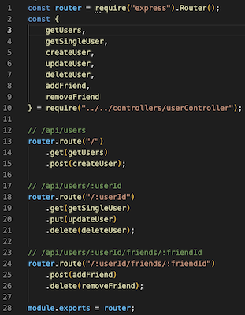

# NoSQL-Social-Network-API

An API for a social network web application where users can share their thoughts, react to friends’ thoughts, and create a friend list.

## Table of Contents

[Installation](#installation)

[Useage](#useage)

[License](#license)

[Contribute](#contribute)

[Test](#test)

[Questions](#questions)

## Description

This is an application that uses NoSQL. NoSQL stands for "not only SQL(Structured Query Language)" and is a database management system that differs from SQL. They are designed to handle large-scare and sometimes unstructured data. NoSQL uses different models, routes, and controllers to allow for scaling. There is no schema that eliminates specific data modeling. 

This app is made for use by a large numbers of users. A user has a profile and can create a friends list consisting of other users. Users can have their thoughts posted and other users can react to them. You can update users, thoughts, and even reactions! Everything can also be deleted!

## Installation

Download the files to a folder on your computer. Open a Terminal and in the command line you will enter the following commands:

npm i - this installs all the packages needed. 
npm start - this will start the application. open insomnia to proceed. 

## Useage
  
Shown below is a image showing the different user routes and the simplicity of them:

Enter any of these routes in the insomnia url. Refer to the models to see what you may need for the body. From here you can create and test the different routes to users, thoughts, and reactions. 

## License

MIT

## Contribution

This was built by myself. 

## Test

Please view this video to see a test of the application. 

## Questions
Github Repo: https://github.com/tylerdins88/NoSQL-Social-Network-API

Email: tyler.dins88@gmail.com